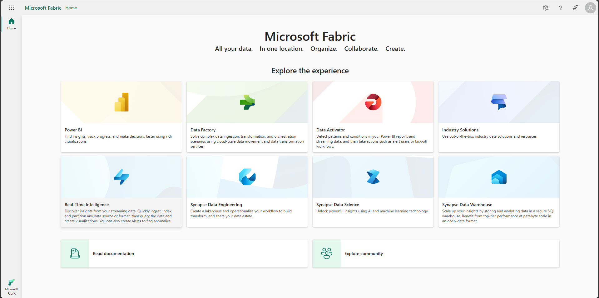
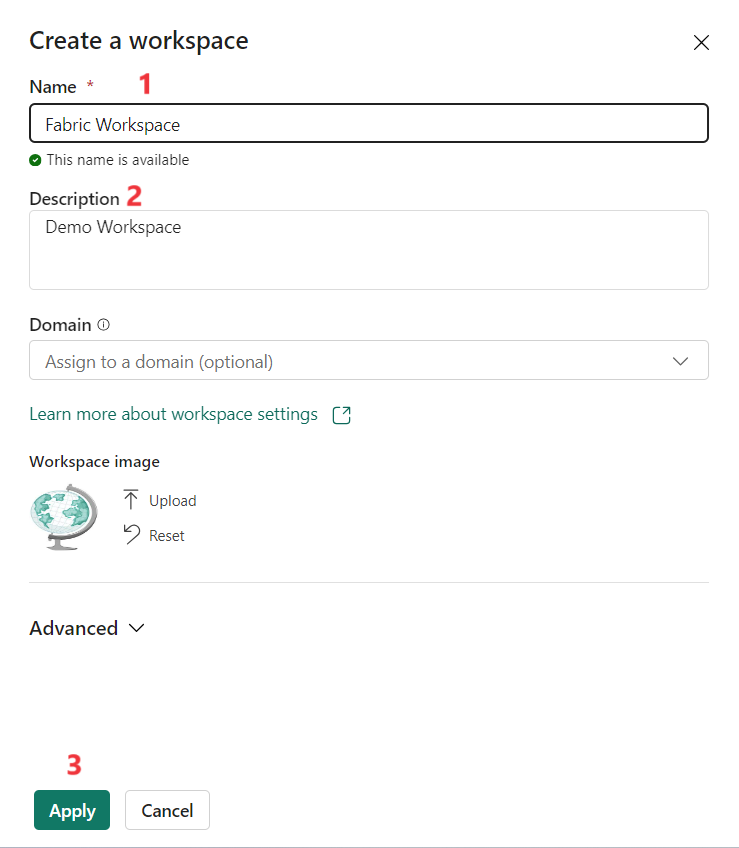
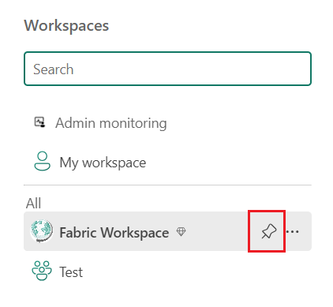

# Lab 02 - Setting up Microsoft Fabric Workspace

**Objectives**

- In this Lab, you will learn how to create workspaces in Microsoft
  Fabric

- You give access to it by adding them to the different roles.

## Task 1 - Creating a Workspace

1.  Open a new tab and paste the ```https://app.fabric.microsoft.com/home?experience=data-engineering&clientSideAuth=0```
    URL.

2.  Login to Fabric Home page with your credentials.

    

3.  On the bottom left side corner of the page click on **Microsoft
    Fabric** and select **Power BI**

    

4.  Select **Workspaces** \> **New workspace**. The Create a workspace
    pane opens.

    

5.  The **Create a workspace** pane opens.

6.  Enter the below details:

    1.  Name - ```Fabric Workspace```

    2.  Description - ```Demo workspace```

    3.  You can also upload an image for your workspace which is
        optional.

7.  When done, either continue to the advanced settings, or
    select **Apply**.

    

    

**Task 2 - Give access to your workspace**

1.  Because you have the Admin or Member role in the workspace, on the
    top right corner of the Fabric workspace page, click on **Manage
    Access.**

    

2.  Select **Add people, groups** **or Links**

    

3.  Enter name or email, select a role, and select **Add**. You can add security groups, distribution lists,
    Microsoft 365 groups, or individuals to these workspaces as admins, members, contributors, or viewers. If you have the member role, you can only add others to the member, contributor, or viewer roles.


4.  You can view and modify access later if needed. Use
    the **Search**box to search for people or groups who already have
    access of this workspace. To modify access, select the drop-down
    arrow, and select a role.

**Task 3 - Pin workspaces**

Quickly access your favorite workspaces by pinning them to the top of
the workspace flyout list.

1.  Open the workspace flyout from the navigation pane and hover over
    the workspace you want to pin. Select the **Pin to top** icon.



2.  The workspace is added to the **Pinned** list.


3.  To unpin a workspace, select the unpin button. The workspace is
    unpinned.

**Summary**

- You have created workspace in Microsoft Fabric by providing access to
  others and quickly access your favorite workspaces by pinning them to
  the top of the workspace flyout list.
