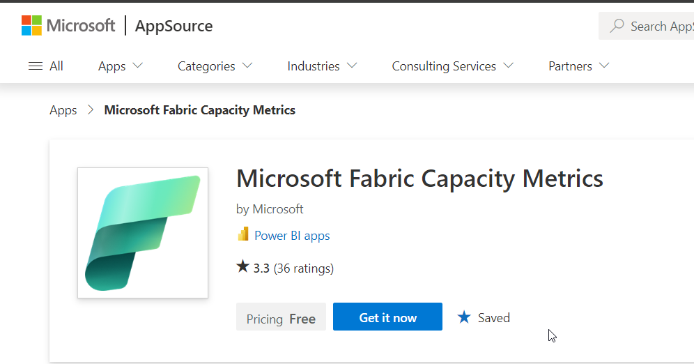
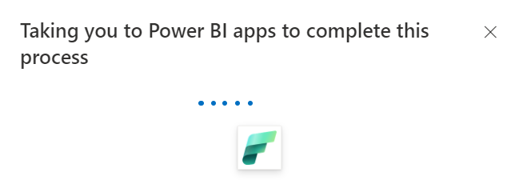
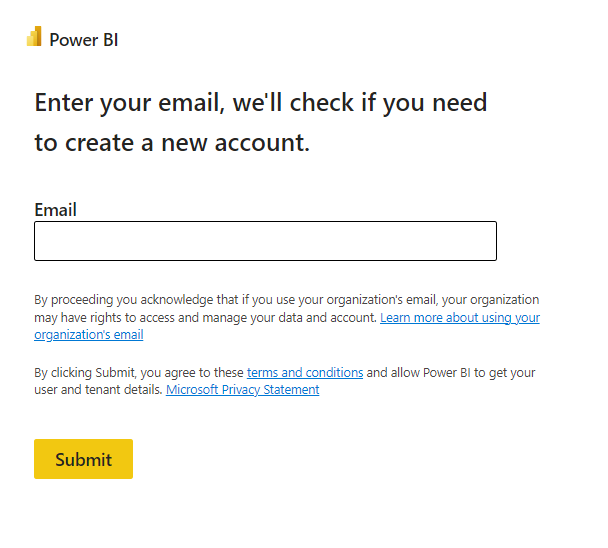
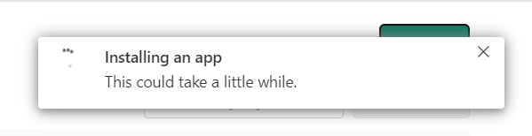
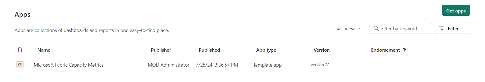
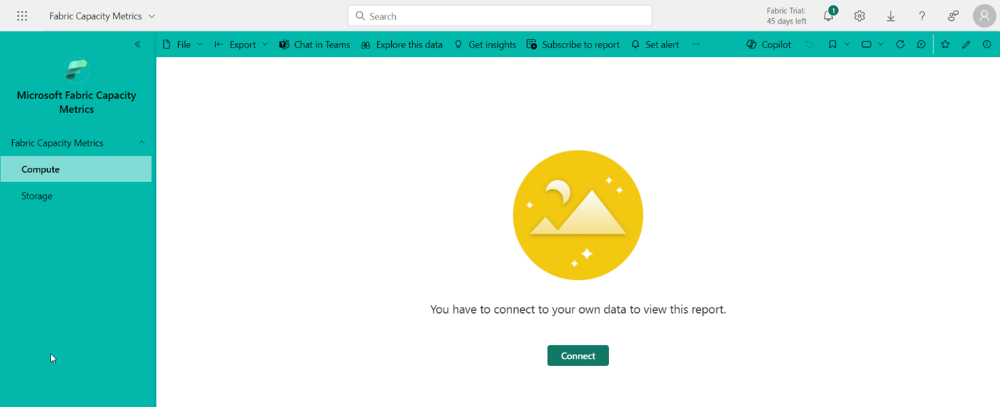
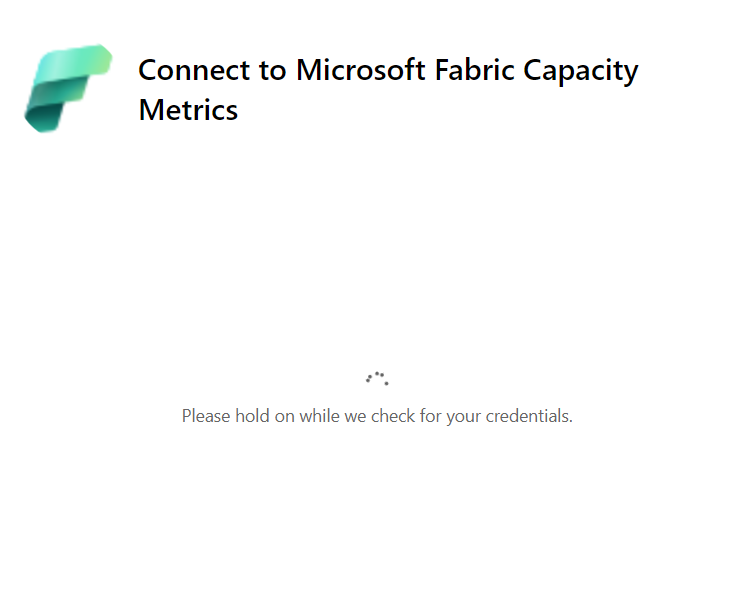
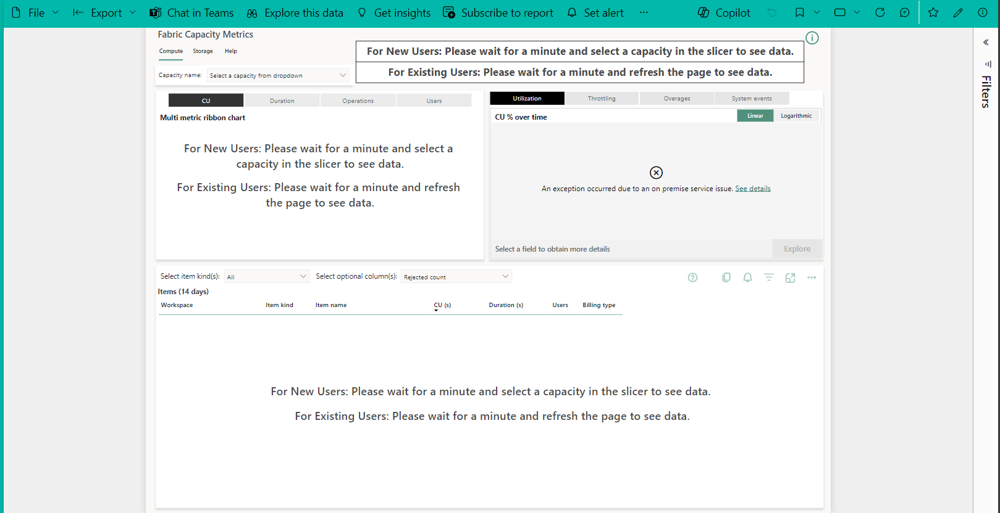

# Lab 07 - Installing the Microsoft Fabric capacity metrics app

**Objectives**

- In this Lab, you install the Microsoft Fabric Capacity Metrics App and
  run the app

## Task 1 – Installing the Microsoft Fabric Capacity Metrics App

To install the *Microsoft Fabric Capacity Metrics* app for the first
time, follow these steps:

1.  Go to AppSource \> Microsoft Fabric Capacity Metrics and
    select **Get it now**.

> https://appsource.microsoft.com/en-us/product/power-bi/pbi_pcmm.microsoftpremiumfabricpreviewreport?exp=ubp8

    

2.  You will be navigated to Power BI apps to complete the process.

    

3.  Provide your Admin email address to proceed and select **Submit**.

    

4.  The app takes you to Microsoft Fabric to complete the process.
    Select **Install** to continue.

5.  In the *Install this Power BI app* window, select **Install**.

    

6.  Wait a few seconds for the app to install.

    

7.  The App is successfully installed. Click on the App to run it for
    the first time.

    

## Task 2 - Run the Metrics App

To complete the installation, configure the Microsoft Fabric Capacity
Metrics app by running it for the first time.

1.  In Microsoft Fabric, select **Apps**.

2.  Select the **Microsoft Fabric Capacity Metrics** app.

3.  When you see the message – “*You have to connect to your own data to
    view this report”*, select **Connect**.

    

4.  In the **Connect to Microsoft Fabric Capacity Metrics** first
    window, fill in the below details:

| Field | Required | Value | Notes|
| --- | --- | --- |---|
| Capacity ID | yes | An ID of a capacity you're an admin of | You can find the capacity ID in the URL of the capacity management page. In Microsoft Fabric, go to Settings > Governance and insights > Admin portal > Capacity settings, then select a capacity. The capacity ID is shown in the URL after /capacities/. For example, 9B77CC50-E537-40E4-99B9-2B356347E584 is the capacity ID in this URL: https://app.powerbi.com/admin-portal/capacities/9B77CC50-E537-40E4-99B9-2B356347E584. After installation, the app will let you see all the capacities you can access.|

| UTC_offset | yes | Numerical values ranging from 14 to -12. To signify a Half hour timezone, use .5. For example, for Iran's standard time enter 3.5. | Enter your organization's standard time in Coordinated Universal Time (UTC)|

| Timepoint | Automatically populated |  | This field is automatically populated and is used for internal purposes. The value in this field will be overwritten when you use the app.|

| Timepoint2 | Automatically populated |  | This field is automatically populated and is used for internal purposes. The value in this field will be overwritten when you use the app.|

| Advanced | Optional | On or Off | The app automatically refreshed your data at midnight. This option can be disabled by expanding the advanced option and selecting Off. |

5.  You can find the capacity ID in the URL of the capacity management
    page. In Microsoft Fabric, go to **Settings** \> **Governance and
    insights** \> **Admin portal** \> **Capacity settings**, then select
    a capacity. The capacity ID is shown in the URL
    after */capacities/*. For
    example, 9B77CC50-E537-40E4-99B9-2B356347E584 is the capacity ID

    

    

    

    

6.  Select **Next**.

7.  In the **Connect to Microsoft Fabric Capacity Metrics** second
    window, complete the following fields:

    1.  **Authentication method** - Select your authentication method.
        The default authentication method is *OAuth2*.

    2.  **Privacy level setting for this data source** -
        Select *Organizational* to enable app access to all the data
        sources in your organization.

8.  Select **Sign in and continue**. Enter your tenant details to
    complete the sign in process.

    > 

9.  After you configure the app, it can take a few minutes for the app
    to get your data. If you run the app and it's not displaying any
    data, refresh the app. This behavior happens only when you open the
    app for the first time.

    

Summary

- You have installed the Microsoft Fabric Capacity Metrics App and run
  the app
